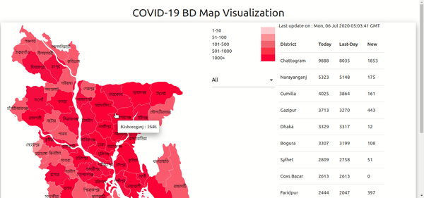

# BD COVID-19 MAP :world_map: :bangladesh:

As COVID-19 is a global pandemic of today's world, Bangladesh has also become the victim of corona virus. Number of COVID-19 patients are increasing day by day in our country and its spreading in every district of our country. As it is spreading fast we may need to get a visual of our country of number of COVID-19 patients in every district. For this purpose, we've made this site where anyone can get overall visual of our country's present status of COVID-19.

## Work flow

We used this [API](https://corona-bd.herokuapp.com/district) to get the district data of our country and used SVG image to build the map.

You can **hover/click** over the map to get the number of positive cases of that particular district. You can also sort the map by **division** from the select box. In the table all data is shown with pagination. If you **click/hover** the district name from the table you'll see the hovered district becomes white in the map.

## Map gif

|            BD MAP            |
| :--------------------------: |
|  |

## Usage

If you want to embed this map in your website you can do so by adding the following code in your html.

```html

<iframe
      src="https://pro-js.github.io/bdCovidMap/"
      height="400"
      width="200"
      frameborder="0"
      scrolling="auto"
      class="frame-area"
      title="BD COVID-19 MAP"
    ></iframe>
```

To make it responsive you can add the following `css` code into your style.
```css
.frame-area {
    display: block;
    width: 100%; /* RESPONSIVE WIDTH */
    max-width: 1330px;
    height: 600px;
    overflow: auto;
    margin: 0px;
    padding: 0px;
}
```

### If you like our work please give us a :star: to show your appreciation about our work.


